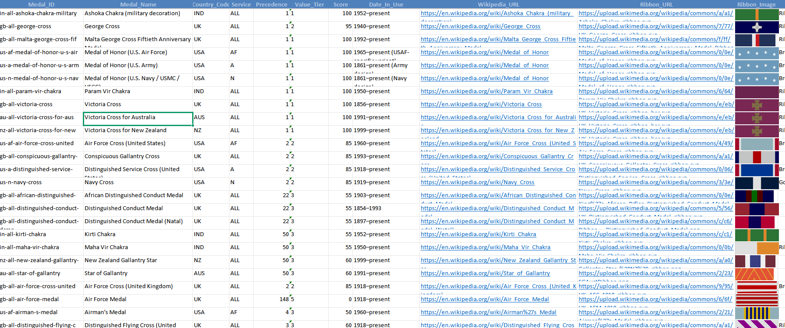

# 🏅 Military Medals Excel Builder

A Python-based data collection and Excel generation tool that automatically builds a structured military medals dataset using Wikipedia APIs and Wikimedia Commons resources.

## Overview

This project retrieves military medal information from multiple countries, identifies the correct ribbon images, downloads and validates those images, and generates a professional Excel workbook with embedded ribbon thumbnails and reference links.

The system is designed to automate medal catalog creation while maintaining data quality through image validation, ribbon detection logic, fallback mechanisms, and structured Excel formatting.

---

## Supported Countries

- 🇺🇸 United States
- 🇨🇦 Canada
- 🇳🇿 New Zealand
- 🇦🇺 Australia
- 🇮🇳 India

---

## Features

### Automated Medal Collection
- Retrieves medal information directly from Wikipedia
- Supports both page-based and category-based medal discovery
- Filters non-medal pages automatically
- Collects medal names and official Wikipedia references

### Intelligent Ribbon Detection
- Scans medal pages for ribbon images
- Uses filename analysis and image-shape detection
- Excludes logos, flags, portraits, insignia, and unrelated graphics
- Supports fallback ribbon discovery when primary methods fail

### Image Processing
- Downloads ribbon images automatically
- Converts images to optimized PNG format
- Resizes images for Excel compatibility
- Stores images locally for future use

### Excel Report Generation
- Creates a formatted Excel workbook
- Embeds ribbon thumbnails directly into cells
- Includes clickable hyperlinks
- Applies professional styling and formatting
- Supports filtering and frozen headers

### Reliability Features
- Wikipedia API integration
- Wikimedia Commons integration
- Retry logic and rate-limit handling
- Image validation and error recovery
- Ribbon matching verification

---

## Output Files

### Excel Workbook

Generated file:

```text
medals_preview_40.xlsx
```

Contains:

| Field | Description |
|---------|-------------|
| Priority | Medal ranking |
| Country | Country code |
| Medal Name | Official medal title |
| Wikipedia Link | Direct Wikipedia article |
| Ribbon Page Link | Wikimedia ribbon reference |
| Ribbon | Embedded ribbon image |

### Image Folder

```text
ribbons/
```

Contains all downloaded ribbon images used in the workbook.

---

## Technology Stack

- Python 3
- Wikipedia API
- Wikimedia Commons API
- Requests
- BeautifulSoup4
- OpenPyXL
- Pillow (PIL)

---

## Installation

```bash
pip install requests beautifulsoup4 openpyxl pillow
```

---

## Usage

Run the script:

```bash
python medals_builder.py
```

After execution:

```text
✔ medals_preview_40.xlsx
✔ ribbons/
```

will be generated automatically.

---

## Project Goals

This project demonstrates:

- Data scraping and extraction
- API integration
- Image processing
- Excel automation
- Data validation
- Structured dataset generation

and serves as a foundation for building larger military decorations and honors databases with scoring, precedence, hierarchy, and automation support.

---

## Disclaimer

This project uses publicly available information from Wikipedia and Wikimedia Commons for educational and research purposes. All trademarks, images, and content belong to their respective owners.

